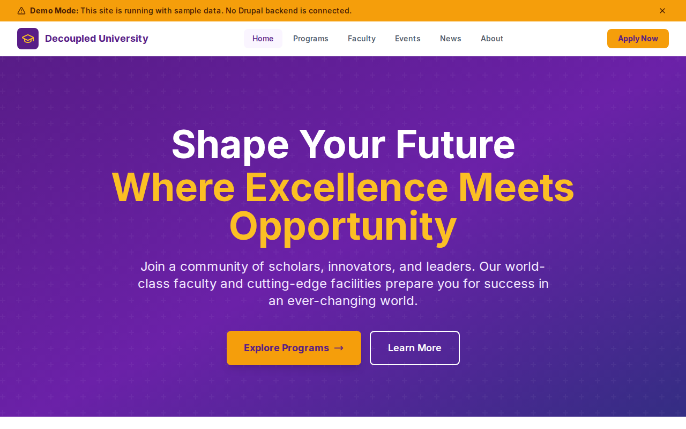

# Decoupled University

A university website starter template for Decoupled Drupal + Next.js. Built for colleges, universities, and educational institutions.



## Features

- **Academic Programs** - Showcase degree programs with details, requirements, and highlights
- **Faculty Directory** - Faculty profiles with research interests, education, and contact info
- **Events Calendar** - Campus events, lectures, ceremonies with registration
- **News & Announcements** - University news with categories and featured articles
- **Modern Design** - Clean, accessible UI optimized for educational content

## Quick Start

### 1. Clone the template

```bash
npx degit nextagencyio/decoupled-university my-university
cd my-university
npm install
```

### 2. Authenticate with Decoupled.io

```bash
npx decoupled-cli auth login
```

This opens a browser to authenticate with your Decoupled.io account.

### 3. Create a Drupal space

```bash
npx decoupled-cli spaces create "My University"
```

Note the space ID returned (e.g., `Space ID: 1234`). Wait ~90 seconds for provisioning.

### 4. Configure environment

Fetch OAuth credentials and save to `.env.local`:

```bash
npx decoupled-cli spaces env 1234 --write .env.local
```

Or manually copy from [dashboard.decoupled.io](https://dashboard.decoupled.io).

### 5. Import content

```bash
npm run setup-content
```

This imports the university content types and sample content:
- Homepage with statistics and CTAs
- 6 Academic Programs (Computer Science, Psychology, Mechanical Engineering, English Literature, Finance, Biology)
- 2 Faculty Members
- 2 Events (Open House, Commencement)
- 2 News Articles
- 2 Static Pages (About, Admissions)

### 6. Start development

```bash
npm run dev
```

Visit [http://localhost:3000](http://localhost:3000)

## Content Types

### Academic Program
- Title, Body
- Degree Type (Bachelor's, Master's, etc.)
- Department (taxonomy)
- Duration, Credits
- Program Highlights (paragraphs)

### Faculty Member
- Title (name), Body (bio)
- Position, Department
- Contact info (email, phone, office)
- Photo, Research Interests
- Education credentials

### Campus Event
- Title, Body
- Event Date, End Date
- Location
- Event Type (taxonomy)
- Registration URL

### News Article
- Title, Body
- Featured Image
- Category (taxonomy)
- Featured flag

## Customization

### Colors & Branding
Edit `tailwind.config.js` to customize colors, fonts, and spacing.

### Content Structure
Modify `data/university-content.json` to add or change content types and sample content.

### Components
React components are in `app/components/`. Update them to match your design needs.

## Deployment

### Vercel (Recommended)
[](https://vercel.com/new/clone?repository-url=https://github.com/nextagencyio/decoupled-university)

### Other Platforms
Works with any Node.js hosting platform that supports Next.js.

## Documentation

- [Decoupled.io Docs](https://www.decoupled.io/docs)
- [Next.js Documentation](https://nextjs.org/docs)
- [Drupal GraphQL](https://www.decoupled.io/docs/graphql)

## License

MIT
